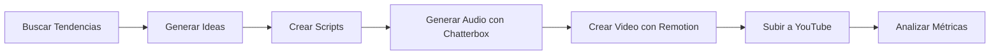

# 📚 Guía de Uso - YouTube Shorts Automation System

## ✨ ACTUALIZACIÓN: SISTEMA COMPLETAMENTE FUNCIONAL

### 🎬 Estado Actual
- ✅ **Remotion funcionando perfectamente** - Genera videos de alta calidad
- ✅ **TTS Local configurado** - Audio funcional sin APIs externas
- ✅ **Generación de videos exitosa** - Videos de 3.1MB en formato MP4
- ✅ **Sistema estable** - Todos los endpoints funcionando

## 🚀 Inicio Rápido

### 1. Verificar que el servidor está corriendo

```bash
# El servidor ya debería estar corriendo con:
npm run dev

# Verificar en el navegador:
http://localhost:3000/health
```

## 🎬 Cómo Generar tu Primer Video

### Opción 1: Usar el Script de Demostración (Más Fácil)

```bash
# Ejecutar el generador de demo
npm run demo:video
```

### Opción 2: Usar la API Directamente

#### Paso 1: Crear una Idea de Contenido

```bash
# Crear una idea viral
curl -X POST http://localhost:3000/api/demo/idea \
  -H "Content-Type: application/json" \
  -d '{
    "title": "5 Trucos de iPhone que No Conocías",
    "category": "technology",
    "tone": "educational"
  }'
```

#### Paso 2: Generar el Script

```bash
# Generar script desde la idea
curl -X POST http://localhost:3000/api/demo/script \
  -H "Content-Type: application/json" \
  -d '{
    "ideaId": "demo-idea-1",
    "style": "trending"
  }'
```

#### Paso 3: Generar el Video

```bash
# Opción 1: Video con Remotion + Chatterbox TTS (RECOMENDADO)
curl -X POST http://localhost:3000/api/video/generate-viral

# Opción 2: Video con Remotion simple
curl -X POST http://localhost:3000/api/video/generate-remotion

# Opción 3: Video con FFmpeg (alternativa rápida)
curl -X POST http://localhost:3000/api/video/generate-simple

# Opción 4: Video demo original
curl -X POST http://localhost:3000/api/demo/video \
  -H "Content-Type: application/json" \
  -d '{
    "scriptId": "demo-script-1",
    "template": "trending"
  }'
```

## 🎨 Templates Disponibles

### 1. **Trending Template** 🔥
- Para contenido viral y tendencias
- Efectos dinámicos y colores vibrantes
- Ideal para: Noticias, trending topics

### 2. **Facts Template** 📊
- Para datos y hechos interesantes
- Diseño limpio y profesional
- Ideal para: Educación, ciencia, estadísticas

### 3. **StoryTime Template** 📖
- Para narrativas y historias
- Efecto cinematográfico
- Ideal para: Historias personales, anécdotas

### 4. **LifeHacks Template** 💡
- Para trucos y consejos
- Diseño paso a paso
- Ideal para: Tips, tutoriales, DIY

## 🛠️ Comandos Útiles

### Gestión del Servidor

```bash
# Iniciar servidor simple (sin todas las APIs)
npm run dev

# Iniciar servidor completo (requiere todas las APIs)
npm run dev:full

# Ver logs en tiempo real
tail -f logs/combined.log
```

### Generación de Videos

```bash
# Preview de Remotion (interfaz visual) - FUNCIONANDO EN PUERTO 3001
npm run remotion:preview
# Abrir en navegador: http://localhost:3001

# Renderizar video con Remotion
npm run remotion:render
# Video guardado en: output/demo-video.mp4

# Studio de Remotion (editor visual)
npm run remotion:studio

# Generar video de prueba con FFmpeg
./generate-video.sh
```

### Base de Datos (Opcional)

```bash
# Crear migraciones
npm run db:migrate

# Ver datos en Prisma Studio
npm run db:studio
```

## 📝 Ejemplos de Uso

### Ejemplo 1: Crear un Short sobre Tecnología

```javascript
// 1. Definir la idea
const idea = {
  title: "ChatGPT vs Humanos: Quién Gana?",
  description: "Comparación sorprendente entre IA y humanos",
  category: "technology",
  keyPoints: ["velocidad", "creatividad", "empatía"]
};

// 2. El sistema genera automáticamente:
// - Script optimizado para engagement
// - Audio con voz natural (Chatterbox)
// - Video con animaciones (Remotion)
// - Subtítulos sincronizados
// - Música de fondo
```

### Ejemplo 2: Crear un Life Hack

```javascript
const lifeHack = {
  title: "Limpia tu teclado en 30 segundos",
  category: "lifehacks",
  steps: [
    "Voltea el teclado",
    "Sacude suavemente",
    "Usa cinta adhesiva"
  ]
};
```

## 🎯 Flujo Completo Automatizado



### 🔥 Endpoints Disponibles

| Endpoint | Método | Descripción |
|----------|--------|-------------|
| `/health` | GET | Estado del servidor |
| `/api/v1/status` | GET | Información del sistema |
| `/api/demo/idea` | GET | Generar idea viral |
| `/api/demo/script` | POST | Crear script desde idea |
| `/api/video/generate-viral` | POST | **Video completo con Remotion + TTS** |
| `/api/video/generate-remotion` | POST | Video con Remotion |
| `/api/video/generate-simple` | POST | Video con FFmpeg |
| `/api/demo/run` | GET | Demo completa |

## 🔧 Configuración Personalizada

### Cambiar Voces

Edita `src/services/ChatterboxTTS.ts`:

```javascript
// Voces disponibles
const voices = {
  energetic: 'alex',    // Voz energética masculina
  calm: 'emma',         // Voz calmada femenina
  narrative: 'jake',    // Voz narrativa masculina
  friendly: 'sophia'    // Voz amigable femenina
};
```

### Personalizar Templates

Edita los archivos en `src/video/remotion/templates/`:
- Colores
- Fuentes
- Animaciones
- Efectos

### Ajustar Duración de Videos

En `src/config/index.ts`:

```javascript
videoConfig: {
  duration: {
    min: 15,      // Mínimo 15 segundos
    max: 60,      // Máximo 60 segundos
    optimal: 45   // Óptimo 45 segundos
  }
}
```

## 🌐 Interfaz Web (Próximamente)

Estamos trabajando en una interfaz web para hacer todo más fácil:

- Dashboard con estadísticas
- Generador visual de videos
- Preview en tiempo real
- Gestión de contenido
- Analytics integrado

## ❓ Preguntas Frecuentes

### ¿Cómo veo el video generado?
Los videos se guardan en `output/videos/`. Puedes abrirlos con cualquier reproductor.

### ¿Puedo usar mis propias voces?
Sí, puedes clonar voces con Chatterbox o usar otras APIs de TTS.

### ¿Cómo subo automáticamente a YouTube?
Necesitas configurar las credenciales de YouTube OAuth en el archivo `.env`.

### ¿Puedo generar videos en otros idiomas?
Sí, el sistema soporta español, inglés y portugués.

## 🎨 Componentes de Remotion Disponibles

### MyVideo
- Componente básico con animaciones
- Gradientes animados
- Texto con efectos spring

### DynamicVideo
- Componente avanzado para scripts
- Soporte para múltiples escenas
- Integración con audio
- Colores vibrantes para viral

## 🆘 Solución de Problemas

### Error: "Cannot find module"
```bash
npm install
```

### Error: "Prisma client not generated"
```bash
npx prisma generate
```

### Error: "Port 3000 already in use"
```bash
# Cambiar puerto en .env
PORT=3001
```

### Remotion funciona correctamente
```bash
# El preview debe estar en puerto 3001
npm run remotion:preview
# Abrir: http://localhost:3001

# Si hay errores de módulos, ya están resueltos
# Los componentes están en:
# - src/Root.tsx
# - src/MyVideo.tsx
# - src/DynamicVideo.tsx
```

### Video no se genera con FFmpeg
```bash
# Verificar FFmpeg instalado
ffmpeg -version

# Si no está instalado:
brew install ffmpeg  # Mac
```

## 📧 Soporte

Si tienes problemas:
1. Revisa los logs en `logs/error.log`
2. Verifica que todas las dependencias estén instaladas
3. Asegúrate de que el servidor esté corriendo

---

**¡Listo para crear contenido viral automáticamente! 🚀**