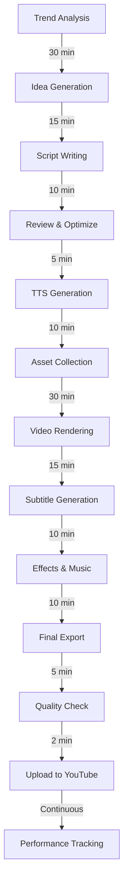

# 🎬 YouTube Shorts Automation System - Plan Completo

## 📋 Índice
1. [Visión General](#visión-general)
2. [Arquitectura del Sistema](#arquitectura-del-sistema)
3. [Stack Tecnológico](#stack-tecnológico)
4. [Componentes Principales](#componentes-principales)
5. [Pipeline de Generación](#pipeline-de-generación)
6. [Estrategias de Viralidad](#estrategias-de-viralidad)
7. [Implementación Detallada](#implementación-detallada)
8. [Automatización y Scheduling](#automatización-y-scheduling)
9. [Monetización](#monetización)
10. [Métricas y Analytics](#métricas-y-analytics)
11. [Escalamiento](#escalamiento)
12. [Roadmap de Desarrollo](#roadmap-de-desarrollo)

## 🎯 Visión General

### Objetivo Principal
Crear un sistema completamente automatizado que:
- Genere 5-10 YouTube Shorts diarios de alta calidad
- Analice tendencias en tiempo real
- Optimice contenido para máxima viralidad
- Publique automáticamente en horarios óptimos
- Aprenda y mejore basándose en métricas de rendimiento

### KPIs Objetivo
- **Vistas por video**: 10K-100K+ en primeras 48h
- **Tasa de retención**: >70%
- **CTR (Click-through rate)**: >15%
- **Engagement rate**: >10%
- **Crecimiento de suscriptores**: 1K-10K/mes

## 🏗️ Arquitectura del Sistema

### Arquitectura de Microservicios

```
┌─────────────────────────────────────────────────────────────┐
│                         FRONTEND                             │
│                    Dashboard Analytics                       │
└────────────────────────┬────────────────────────────────────┘
                         │
┌────────────────────────┴────────────────────────────────────┐
│                      API GATEWAY                             │
│                   (Express + Auth)                           │
└────────────────────────┬────────────────────────────────────┘
                         │
        ┌────────────────┼────────────────┬─────────────────┐
        │                │                │                 │
┌───────▼──────┐ ┌──────▼──────┐ ┌──────▼──────┐ ┌────────▼────────┐
│   CONTENT    │ │    VIDEO    │ │   YOUTUBE   │ │   ANALYTICS     │
│   SERVICE    │ │   SERVICE   │ │   SERVICE   │ │    SERVICE      │
├──────────────┤ ├─────────────┤ ├─────────────┤ ├─────────────────┤
│ - Scraping   │ │ - FFmpeg    │ │ - Upload    │ │ - Metrics       │
│ - AI Scripts │ │ - Editing   │ │ - Metadata  │ │ - ML Insights   │
│ - TTS        │ │ - Rendering │ │ - Schedule  │ │ - A/B Testing   │
└──────────────┘ └─────────────┘ └─────────────┘ └─────────────────┘
        │                │                │                 │
└────────────────────────┴────────────────┴─────────────────┘
                         │
┌────────────────────────┴────────────────────────────────────┐
│                    MESSAGE QUEUE                             │
│                  (Redis + BullMQ)                            │
└────────────────────────┬────────────────────────────────────┘
                         │
┌────────────────────────┴────────────────────────────────────┐
│                     DATABASES                                │
│   PostgreSQL (Main) | Redis (Cache) | S3 (Storage)          │
└──────────────────────────────────────────────────────────────┘
```

## 💻 Stack Tecnológico

### Backend Core
- **Runtime**: Node.js v20+ con TypeScript
- **Framework**: Express.js / Fastify
- **ORM**: Prisma / TypeORM
- **Queue**: BullMQ (Redis-based)
- **Cache**: Redis
- **Database**: PostgreSQL + TimescaleDB (para time-series)

### AI & Content Generation
- **LLM**: OpenAI GPT-4 / Claude 3.5
- **TTS**: ElevenLabs API / Azure Cognitive Services
- **STT**: Whisper API
- **Image Gen**: DALL-E 3 / Stable Diffusion
- **Music**: Mubert API / Soundraw API

### Video Processing
- **Core**: FFmpeg
- **Framework**: Remotion (React-based video)
- **Subtitles**: AssemblyAI / Rev.ai
- **Templates**: After Effects + Bodymovin (Lottie)

### YouTube Integration
- **API**: YouTube Data API v3
- **Auth**: OAuth 2.0
- **Analytics**: YouTube Analytics API
- **Comments**: YouTube Comments API

### Infrastructure
- **Container**: Docker + Docker Compose
- **Orchestration**: Kubernetes (para escalar)
- **CI/CD**: GitHub Actions
- **Monitoring**: Prometheus + Grafana
- **Logging**: Winston + ELK Stack
- **Cloud**: AWS / Google Cloud / DigitalOcean

## 🔧 Componentes Principales

### 1. Trend Analyzer Service
```typescript
interface TrendAnalyzer {
  sources: {
    reddit: RedditScraper;
    tiktok: TikTokScraper;
    twitter: TwitterScraper;
    youtube: YouTubeTrends;
    google: GoogleTrends;
  };
  
  analyze(): Promise<TrendReport>;
  scoreViralPotential(topic: Topic): number;
  generateContentIdeas(trends: Trend[]): ContentIdea[];
}
```

**Funcionalidades**:
- Scraping cada 2-4 horas
- Análisis de sentimiento
- Detección de patrones virales
- Predicción de tendencias emergentes
- Scoring de potencial viral (0-100)

### 2. Content Generator Service
```typescript
interface ContentGenerator {
  scriptWriter: AIScriptWriter;
  hookGenerator: HookGenerator;
  titleOptimizer: TitleOptimizer;
  hashtagGenerator: HashtagGenerator;
  
  generateScript(idea: ContentIdea): Promise<Script>;
  optimizeForPlatform(script: Script): Script;
  generateVariations(script: Script): Script[];
}
```

**Estrategias de Contenido**:
- **Formatos probados**: Storytime, Facts, Life Hacks, Reactions
- **Hooks potentes**: Primeros 3 segundos críticos
- **Estructura**: Hook → Build-up → Climax → CTA
- **Duración óptima**: 30-59 segundos

### 3. Video Production Pipeline
```typescript
interface VideoProducer {
  renderer: VideoRenderer;
  editor: VideoEditor;
  effects: EffectsProcessor;
  audio: AudioProcessor;
  
  createVideo(script: Script): Promise<Video>;
  addSubtitles(video: Video): Video;
  addEffects(video: Video): Video;
  optimize(video: Video): Video;
}
```

**Pipeline de Producción**:
1. **Template Selection**: Elegir template según categoría
2. **Asset Generation**: Imágenes, clips, iconos
3. **Audio Production**: TTS + música de fondo + SFX
4. **Video Assembly**: Composición de todas las capas
5. **Post-Processing**: Color grading, transiciones, efectos
6. **Quality Check**: Verificación automática de calidad

### 4. YouTube Manager Service
```typescript
interface YouTubeManager {
  uploader: VideoUploader;
  scheduler: UploadScheduler;
  optimizer: SEOOptimizer;
  analytics: AnalyticsTracker;
  
  upload(video: Video, metadata: Metadata): Promise<UploadResult>;
  scheduleUpload(video: Video, time: Date): void;
  updateMetadata(videoId: string, metadata: Metadata): void;
  trackPerformance(videoId: string): Analytics;
}
```

## 🎬 Pipeline de Generación

### Flujo Completo (6-8 horas por lote)



### Proceso Detallado por Etapa

#### Etapa 1: Research & Ideation (45 min)
```javascript
// Ejemplo de configuración
const researchConfig = {
  sources: ['reddit', 'tiktok', 'twitter', 'youtube'],
  categories: ['tech', 'lifehacks', 'science', 'psychology', 'finance'],
  minViralScore: 75,
  ideasPerBatch: 20,
  filters: {
    nsfw: false,
    controversial: false,
    copyright: false
  }
};
```

#### Etapa 2: Script Generation (25 min)
```javascript
const scriptTemplate = {
  hook: "Did you know that...", // 0-3 seconds
  setup: "Context and buildup",  // 3-15 seconds
  reveal: "Main content",        // 15-45 seconds
  twist: "Unexpected element",   // 45-50 seconds
  cta: "Follow for more!"        // 50-59 seconds
};
```

#### Etapa 3: Production (60 min)
```javascript
const productionSettings = {
  resolution: '1080x1920',  // 9:16 vertical
  fps: 30,
  codec: 'h264',
  bitrate: '8M',
  audioCodec: 'aac',
  audioBitrate: '128k'
};
```

## 🚀 Estrategias de Viralidad

### 1. Algoritmo de YouTube Shorts

**Factores Clave**:
- **AVD (Average View Duration)**: >90% es ideal
- **Swipe Rate**: <30% (usuarios que pasan el video)
- **Replay Rate**: >1.5x
- **Share Rate**: >2%
- **Comment Rate**: >1%

### 2. Técnicas Psicológicas

#### Pattern Interrupt
```javascript
const patternInterrupts = [
  { time: 3, type: 'visual_change' },
  { time: 7, type: 'audio_spike' },
  { time: 15, type: 'text_reveal' },
  { time: 25, type: 'speed_change' }
];
```

#### Emotional Triggers
- **Curiosity Gap**: "You won't believe what happened next..."
- **FOMO**: "Only 1% of people know this..."
- **Social Proof**: "5 million people tried this..."
- **Authority**: "Scientists discovered..."
- **Urgency**: "Before it's too late..."

### 3. Optimización de Títulos

```javascript
const titleFormulas = [
  "{Number} {Adjective} {Topic} That {Benefit}",
  "How {Person/Group} {Achievement} (And You Can Too)",
  "Why {Common Belief} Is {Contrarian View}",
  "The {Adjective} Truth About {Topic}",
  "{Time} {Action} Challenge - {Result}"
];
```

### 4. Thumbnail Strategy

```javascript
const thumbnailRules = {
  faces: true,           // Caras humanas aumentan CTR 38%
  emotions: 'extreme',   // Expresiones exageradas
  contrast: 'high',      // Colores vibrantes
  text: 'minimal',       // Máximo 3-4 palabras
  arrows: true,          // Elementos que guían la vista
  mystery: true          // Elemento parcialmente oculto
};
```

## 📝 Implementación Detallada

### Fase 1: Setup Inicial (Día 1-2)

#### 1.1 Inicialización del Proyecto
```bash
# Crear proyecto
mkdir yt-auto && cd yt-auto
npm init -y

# Configurar TypeScript
npm install -D typescript @types/node ts-node nodemon
npx tsc --init

# Estructura de carpetas
mkdir -p src/{api,services,workers,scrapers,generators,video,youtube,utils}
mkdir -p config assets output logs data
```

#### 1.2 Dependencias Core
```json
{
  "dependencies": {
    "express": "^4.18.0",
    "bullmq": "^4.0.0",
    "prisma": "@prisma/client",
    "redis": "^4.6.0",
    "axios": "^1.5.0",
    "openai": "^4.0.0",
    "googleapis": "^128.0.0",
    "fluent-ffmpeg": "^2.1.2",
    "remotion": "^4.0.0",
    "winston": "^3.10.0",
    "dotenv": "^16.3.0",
    "zod": "^3.22.0"
  }
}
```

### Fase 2: Core Services (Día 3-7)

#### 2.1 Trend Scraper Implementation
```typescript
// src/scrapers/RedditScraper.ts
import { Reddit } from 'snoowrap';

export class RedditScraper {
  private client: Reddit;
  
  async getTrendingTopics(subreddits: string[]): Promise<Topic[]> {
    const topics: Topic[] = [];
    
    for (const subreddit of subreddits) {
      const posts = await this.client.getSubreddit(subreddit)
        .getHot({ limit: 50 });
      
      const processed = this.processRedditPosts(posts);
      topics.push(...processed);
    }
    
    return this.rankByViralPotential(topics);
  }
  
  private calculateViralScore(post: RedditPost): number {
    const factors = {
      upvotes: post.score * 0.3,
      comments: post.num_comments * 0.2,
      awards: post.total_awards_received * 0.1,
      crosspostable: post.is_crosspostable ? 0.1 : 0,
      media: post.is_video ? 0.2 : 0.1,
      recency: this.getRecencyScore(post.created_utc) * 0.1
    };
    
    return Object.values(factors).reduce((a, b) => a + b, 0);
  }
}
```

#### 2.2 AI Script Generator
```typescript
// src/generators/ScriptGenerator.ts
import OpenAI from 'openai';

export class ScriptGenerator {
  private openai: OpenAI;
  
  async generateScript(topic: Topic): Promise<Script> {
    const prompt = this.buildPrompt(topic);
    
    const completion = await this.openai.chat.completions.create({
      model: "gpt-4-turbo-preview",
      messages: [
        {
          role: "system",
          content: `You are a viral YouTube Shorts scriptwriter. 
                   Create engaging scripts that:
                   - Hook viewers in first 3 seconds
                   - Maintain high retention throughout
                   - End with a strong CTA
                   - Use pattern interrupts every 5-7 seconds
                   - Total duration: 30-59 seconds`
        },
        {
          role: "user",
          content: prompt
        }
      ],
      temperature: 0.8,
      max_tokens: 500
    });
    
    return this.parseScript(completion.choices[0].message.content);
  }
  
  private buildPrompt(topic: Topic): string {
    return `Create a viral YouTube Short script about: ${topic.title}
            Category: ${topic.category}
            Target audience: ${topic.audience}
            Tone: ${topic.tone}
            Key points: ${topic.keyPoints.join(', ')}`;
  }
}
```

#### 2.3 Video Production Service
```typescript
// src/video/VideoProducer.ts
import { bundle } from '@remotion/bundler';
import { renderMedia } from '@remotion/renderer';

export class VideoProducer {
  async createVideo(script: Script, assets: Assets): Promise<string> {
    // 1. Preparar composición de Remotion
    const composition = await this.prepareComposition(script, assets);
    
    // 2. Renderizar video
    const outputPath = `./output/video_${Date.now()}.mp4`;
    
    await renderMedia({
      composition,
      serveUrl: bundle.serveUrl,
      codec: 'h264',
      outputLocation: outputPath,
      inputProps: {
        script,
        assets,
        effects: this.getEffectsConfig()
      }
    });
    
    // 3. Post-procesamiento con FFmpeg
    await this.postProcess(outputPath);
    
    return outputPath;
  }
  
  private async postProcess(videoPath: string): Promise<void> {
    // Añadir música de fondo, ajustar audio, etc.
    const ffmpeg = require('fluent-ffmpeg');
    
    return new Promise((resolve, reject) => {
      ffmpeg(videoPath)
        .audioCodec('aac')
        .videoCodec('libx264')
        .outputOptions([
          '-crf 23',
          '-preset fast',
          '-movflags +faststart'
        ])
        .on('end', resolve)
        .on('error', reject)
        .save(videoPath.replace('.mp4', '_final.mp4'));
    });
  }
}
```

### Fase 3: YouTube Integration (Día 8-10)

#### 3.1 YouTube Upload Service
```typescript
// src/youtube/YouTubeUploader.ts
import { google } from 'googleapis';

export class YouTubeUploader {
  private youtube = google.youtube('v3');
  
  async uploadVideo(
    videoPath: string, 
    metadata: VideoMetadata
  ): Promise<string> {
    const auth = await this.authenticate();
    
    const response = await this.youtube.videos.insert({
      auth,
      part: ['snippet', 'status'],
      requestBody: {
        snippet: {
          title: metadata.title,
          description: this.buildDescription(metadata),
          tags: metadata.tags,
          categoryId: metadata.categoryId,
          defaultLanguage: 'es',
          defaultAudioLanguage: 'es'
        },
        status: {
          privacyStatus: metadata.scheduled ? 'private' : 'public',
          publishAt: metadata.publishAt,
          selfDeclaredMadeForKids: false
        }
      },
      media: {
        body: fs.createReadStream(videoPath)
      }
    });
    
    return response.data.id;
  }
  
  private buildDescription(metadata: VideoMetadata): string {
    return `${metadata.description}

🔔 Suscríbete para más contenido viral
👍 Dale like si te gustó
💬 Comenta tu opinión
📱 Comparte con tus amigos

${metadata.hashtags.map(h => `#${h}`).join(' ')}

Timestamps:
${metadata.timestamps.map(t => `${t.time} - ${t.label}`).join('\n')}`;
  }
}
```

### Fase 4: Automation System (Día 11-12)

#### 4.1 Scheduler Service
```typescript
// src/services/Scheduler.ts
import { Queue, Worker } from 'bullmq';

export class AutomationScheduler {
  private queue: Queue;
  
  constructor() {
    this.queue = new Queue('video-production', {
      connection: redis
    });
    
    this.setupWorkers();
    this.scheduleJobs();
  }
  
  private async scheduleJobs() {
    // Análisis de tendencias cada 4 horas
    await this.queue.add('analyze-trends', {}, {
      repeat: { pattern: '0 */4 * * *' }
    });
    
    // Generación de videos 3 veces al día
    await this.queue.add('generate-videos', {}, {
      repeat: { pattern: '0 8,14,20 * * *' }
    });
    
    // Upload en horarios óptimos
    const optimalTimes = ['09:00', '13:00', '18:00', '21:00'];
    for (const time of optimalTimes) {
      await this.queue.add('upload-video', {}, {
        repeat: { pattern: `0 ${time.split(':')[1]} ${time.split(':')[0]} * * *` }
      });
    }
  }
  
  private setupWorkers() {
    new Worker('video-production', async (job) => {
      switch(job.name) {
        case 'analyze-trends':
          await this.analyzeTrends();
          break;
        case 'generate-videos':
          await this.generateVideoBatch();
          break;
        case 'upload-video':
          await this.uploadNextVideo();
          break;
      }
    });
  }
}
```

## 📊 Automatización y Scheduling

### Horarios Óptimos de Publicación

```javascript
const optimalSchedule = {
  weekdays: {
    morning: '06:00-09:00',    // Commute time
    lunch: '12:00-13:00',       // Lunch break
    evening: '17:00-20:00',     // After work
    night: '21:00-23:00'        // Before bed
  },
  weekends: {
    morning: '09:00-11:00',     // Weekend morning
    afternoon: '14:00-17:00',   // Weekend afternoon
    evening: '19:00-22:00'      // Weekend evening
  },
  bestDays: ['Tuesday', 'Thursday', 'Saturday'],
  avoidTimes: ['03:00-05:00'] // Low engagement
};
```

### Sistema de Colas y Prioridades

```typescript
interface QueuePriority {
  trending: 1,      // Contenido de tendencias actuales
  scheduled: 2,     // Contenido programado
  evergreen: 3,     // Contenido atemporal
  experimental: 4   // Pruebas A/B
}

class ProductionQueue {
  async addJob(job: VideoJob) {
    const priority = this.calculatePriority(job);
    
    await this.queue.add(job.name, job.data, {
      priority,
      delay: job.delay,
      attempts: 3,
      backoff: {
        type: 'exponential',
        delay: 2000
      }
    });
  }
}
```

## 💰 Monetización

### Estrategias de Ingresos

#### 1. YouTube Partner Program
- **Requisitos**: 1000 suscriptores + 10M vistas en Shorts (90 días)
- **Revenue Share**: 45% de ingresos publicitarios
- **CPM Esperado**: $0.01-0.05 por vista

#### 2. Affiliate Marketing
```javascript
const affiliateStrategy = {
  platforms: ['Amazon', 'ClickBank', 'ShareASale'],
  integration: 'descripción + comentario fijado',
  tracking: 'UTM parameters + bitly',
  categories: ['tech', 'lifestyle', 'education'],
  expectedCTR: '2-5%',
  conversionRate: '1-3%'
};
```

#### 3. Productos Digitales
- Cursos online
- Templates de video
- Presets y recursos
- Consultoría

#### 4. Brand Deals
```javascript
const brandDealCriteria = {
  minSubscribers: 10000,
  avgViews: 50000,
  engagementRate: '>5%',
  pricing: {
    mention: '$100-500',
    dedicated: '$500-2000',
    series: '$2000-10000'
  }
};
```

## 📈 Métricas y Analytics

### KPIs Principales

```typescript
interface VideoMetrics {
  // Métricas de Engagement
  views: number;
  likes: number;
  comments: number;
  shares: number;
  saves: number;
  
  // Métricas de Retención
  avgViewDuration: number;
  avgPercentageViewed: number;
  relativeRetention: number[];
  
  // Métricas de Crecimiento
  subscribersGained: number;
  subscribersLost: number;
  
  // Métricas de Revenue
  estimatedRevenue: number;
  rpm: number;
  cpm: number;
}
```

### Dashboard Analytics

```javascript
const analyticsConfig = {
  realtime: {
    views: 'últimas 48 horas',
    velocity: 'vistas por hora',
    trending: 'posición en trending'
  },
  
  performance: {
    ctr: 'Click-through rate',
    retention: 'Curva de retención',
    engagement: 'Likes, comments, shares',
    audience: 'Demografía y geografía'
  },
  
  optimization: {
    abTesting: 'Títulos y thumbnails',
    bestPerformers: 'Top 10% videos',
    worstPerformers: 'Bottom 10% videos',
    patterns: 'Análisis de patrones exitosos'
  }
};
```

### Machine Learning para Optimización

```python
# src/ml/predictor.py
import pandas as pd
from sklearn.ensemble import RandomForestRegressor

class ViralPredictor:
    def __init__(self):
        self.model = RandomForestRegressor()
        
    def train(self, historical_data):
        features = ['hour', 'day_of_week', 'category', 
                   'title_length', 'tags_count', 'thumbnail_colors']
        X = historical_data[features]
        y = historical_data['views_48h']
        
        self.model.fit(X, y)
    
    def predict_performance(self, video_metadata):
        features = self.extract_features(video_metadata)
        predicted_views = self.model.predict([features])
        
        return {
            'predicted_views_48h': predicted_views[0],
            'viral_probability': self.calculate_viral_prob(predicted_views[0]),
            'recommended_changes': self.suggest_improvements(features)
        }
```

## 🚀 Escalamiento

### Estrategia de Crecimiento

#### Fase 1: MVP (Mes 1-2)
- 1 canal
- 3-5 videos/día
- Categoría única
- Automatización básica

#### Fase 2: Optimización (Mes 3-4)
- 1 canal optimizado
- 5-10 videos/día
- 2-3 categorías
- A/B testing activo
- Analytics avanzado

#### Fase 3: Expansión (Mes 5-6)
- 3-5 canales
- 30-50 videos/día total
- Multi-idioma
- Cross-promotion
- Monetización activa

#### Fase 4: Scale (Mes 7-12)
- 10+ canales
- 100+ videos/día
- Network de canales
- Equipo de moderación
- Partnerships y sponsors

### Infraestructura Escalable

```yaml
# docker-compose.yml
version: '3.8'

services:
  api:
    build: ./api
    replicas: 3
    environment:
      - NODE_ENV=production
    depends_on:
      - postgres
      - redis
  
  worker:
    build: ./worker
    replicas: 5
    environment:
      - CONCURRENCY=10
    depends_on:
      - redis
      - postgres
  
  postgres:
    image: postgres:15
    volumes:
      - postgres_data:/var/lib/postgresql/data
    environment:
      - POSTGRES_DB=ytauto
      - POSTGRES_USER=admin
      - POSTGRES_PASSWORD=${DB_PASSWORD}
  
  redis:
    image: redis:7-alpine
    command: redis-server --appendonly yes
    volumes:
      - redis_data:/data
  
  nginx:
    image: nginx:alpine
    ports:
      - "80:80"
      - "443:443"
    volumes:
      - ./nginx.conf:/etc/nginx/nginx.conf
    depends_on:
      - api

volumes:
  postgres_data:
  redis_data:
```

### Optimización de Costos

```javascript
const costOptimization = {
  compute: {
    strategy: 'Spot instances para rendering',
    savings: '70-90%',
    providers: ['AWS Spot', 'GCP Preemptible']
  },
  
  storage: {
    strategy: 'Lifecycle policies',
    hot: 'SSD para videos recientes (7 días)',
    cold: 'Object storage para archivo',
    cdn: 'CloudFlare para thumbnails'
  },
  
  api: {
    openai: 'Batching + caching de prompts similares',
    elevenlabs: 'Bulk generation + voice cloning',
    youtube: 'Batch operations + exponential backoff'
  },
  
  monitoring: {
    alerts: 'Anomalías en costos >20%',
    optimization: 'Review semanal de gastos',
    budget: 'Límites por servicio'
  }
};
```

## 🗓️ Roadmap de Desarrollo

### Sprint 1 (Semana 1-2): Foundation
- [x] Setup proyecto TypeScript
- [x] Configuración Docker
- [x] Base de datos y modelos
- [x] Autenticación YouTube OAuth
- [ ] CI/CD pipeline

### Sprint 2 (Semana 3-4): Content Pipeline
- [ ] Reddit scraper
- [ ] TikTok scraper
- [ ] OpenAI integration
- [ ] Script generator
- [ ] Trend analyzer

### Sprint 3 (Semana 5-6): Video Production
- [ ] FFmpeg integration
- [ ] Remotion setup
- [ ] Template system
- [ ] TTS integration
- [ ] Subtitle generator

### Sprint 4 (Semana 7-8): YouTube Integration
- [ ] Upload service
- [ ] Metadata optimizer
- [ ] Thumbnail generator
- [ ] Scheduling system
- [ ] Analytics tracker

### Sprint 5 (Semana 9-10): Automation
- [ ] Queue system
- [ ] Cron jobs
- [ ] Error handling
- [ ] Retry logic
- [ ] Monitoring

### Sprint 6 (Semana 11-12): Optimization
- [ ] A/B testing system
- [ ] ML predictor
- [ ] Performance optimization
- [ ] Cost optimization
- [ ] Dashboard UI

### Post-Launch Roadmap

#### Q1 2025
- Multi-canal support
- Advanced analytics
- Sponsor detection
- Brand safety filters

#### Q2 2025
- Mobile app
- Real-time collaboration
- API marketplace
- White-label solution

#### Q3 2025
- AI voice cloning
- Custom avatars
- Live streaming automation
- Podcast to Shorts

#### Q4 2025
- Global expansion
- Enterprise features
- Advanced ML models
- IPO preparation 😄

## 🛠️ Comandos y Scripts

### Desarrollo
```bash
# Instalar dependencias
npm install

# Desarrollo con hot-reload
npm run dev

# Build para producción
npm run build

# Tests
npm run test
npm run test:watch
npm run test:coverage

# Linting
npm run lint
npm run lint:fix

# Type checking
npm run type-check
```

### Producción
```bash
# Start production
npm run start

# Start with PM2
pm2 start ecosystem.config.js

# Docker commands
docker-compose up -d
docker-compose logs -f
docker-compose down

# Database migrations
npm run db:migrate
npm run db:seed
npm run db:reset
```

### Monitoreo
```bash
# Ver logs
npm run logs

# Ver métricas
npm run metrics

# Health check
curl http://localhost:3000/health

# Queue dashboard
npm run queue:dashboard
```

## 🔒 Seguridad y Compliance

### Medidas de Seguridad
- Encriptación de API keys
- Rate limiting
- DDoS protection
- Backup automático
- Audit logs

### Compliance
- COPPA compliance (contenido para niños)
- GDPR (datos de usuarios EU)
- Copyright detection
- Content moderation
- Terms of Service YouTube

## 📚 Recursos y Enlaces

### Documentación
- [YouTube Data API](https://developers.google.com/youtube/v3)
- [OpenAI API](https://platform.openai.com/docs)
- [ElevenLabs API](https://docs.elevenlabs.io)
- [FFmpeg Documentation](https://ffmpeg.org/documentation.html)
- [Remotion Docs](https://www.remotion.dev/docs/)

### Herramientas Útiles
- [TubeBuddy](https://www.tubebuddy.com/) - YouTube SEO
- [VidIQ](https://vidiq.com/) - Analytics
- [Canva](https://www.canva.com/) - Thumbnails
- [Epidemic Sound](https://www.epidemicsound.com/) - Música

### Comunidades
- r/YouTubeShorts
- r/NewTubers
- YouTube Creators Discord
- Shorts Creator Fund

## 💡 Tips y Best Practices

### Do's ✅
- Publicar consistentemente
- Responder comentarios primeras 2 horas
- Usar YouTube Shorts shelf
- Optimizar para móvil
- Experimentar con formatos
- Analizar competencia
- Crear series de contenido
- Cross-promote en otras plataformas

### Don'ts ❌
- Clickbait excesivo
- Contenido repetitivo
- Ignorar analytics
- Violar copyright
- Spam en comentarios
- Comprar vistas/subs
- Contenido controversial
- Ignorar feedback

## 🎯 Conclusión

Este sistema está diseñado para maximizar el potencial de viralidad mientras mantiene la calidad y consistencia del contenido. La clave del éxito está en:

1. **Iteración constante** basada en datos
2. **Automatización inteligente** que ahorra tiempo
3. **Contenido de calidad** que aporta valor
4. **Optimización continua** del pipeline
5. **Escalamiento gradual** y sostenible

Con dedicación y las optimizaciones correctas, este sistema puede generar:
- 📈 100K-1M vistas mensuales en 3 meses
- 👥 10K-50K suscriptores en 6 meses
- 💰 $500-5000/mes en 6-12 meses

¡El límite es tu creatividad y capacidad de ejecución! 🚀

---

**Última actualización**: Noviembre 2024
**Versión**: 1.0.0
**Autor**: YouTube Automation System
**Licencia**: MIT